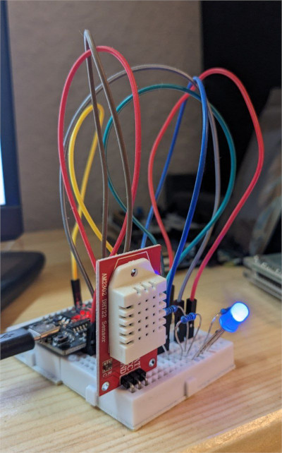
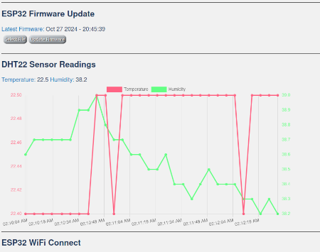

# Architectural Evolution: Lessons from Merging AWS and ESP32 Development

> This article reviews the architecture of cloud-based visualization of the data from ESP32 microcontroller.
>
> My experience may help other developers/architects avoid the problems I encountered during the development process.
>
> The links to the [source code](#links), [how to reproduce](#how-to) and [lessons learnt](#lessons-learnt).

in Summer 2024 I finished one after another trainings, namely [*IoT Application Development with ESP32*](https://www.udemy.com/course/iot-application-development-with-the-esp32-using-the-esp-idf/) from Udemy and *"Deploying Serverless Application on AWS with Terraform"* provided by my former employer. 
Have you had a feeling after passing a training `"hm, that was good but I want to practice it!"`. At least I had one. So I decided make a project where I can leverage the new knowledge. I set two simple goals:
> visualize the data from ESP32 as time series, namely temperature, humidity, RSSI level.
>
> add it to EPS32 embedded web-server and make it as WEB service the cloud.


*Wiring diagram of ESP32 with DHT22 sensor*



*Assembled circuit (with RGB LED which, optional)*

### Visualization in ESP32 embedded web-server

No issues were there. I extended [IoT course's code](https://github.com/kevinudemy/udemy_esp32) by adding `chart.js` library and sensor chart to embedded ESP32 web-server. My fork with extensions and detailed description is located [here](https://github.com/bespsm/esp-data-collection-soc). 



### WEB service visualization on AWS. Initial Software Architecture

The idea was to deploy (Grafana)[https://grafana.com/) as UI on EC2, add AWS IoT Thing as MQTT Broker, use DynamoDB as data storage, set up API Gateway for accessing data over HTTP and add few lambdas to glue things together.


At that moment I didn't really study Grafana and its data sources and naively thinking that it supports data fetching from REST API or DynamoDB out of box.

### Revised Software Architecture: Attempt Two

During the development I decided to simplify design by moving from lambdas and instead use a [python script](https://github.com/bespsm/esp-data-collection-srv/blob/main/script) for forwarding MQTT messages to DynamoDB and use DynamoDB data source in Grafana for fetching time series data. A part from that I replaced AWS IoT MQTT Broker by Eclipse Mosquitto MQTT Broker which I installed on the same EC2 instance where Grafana was. Route53 is used to have a static hostname for ESP32.


At the stage when I tried to connect Grafana and DynamoDB I realized that the current architecture would require additional expenses. I avoided it and come come up with the final architecture design (down below).

Anyways I decided to upload this implementation partially finished (with no Grafana connection). Even more, there are 2 configurations of MQTT communications on the server side, namely using user/pass authentication and using communication over TLS. Pay attention: SoC flashware is configured for TLS communication only.

### Final Software Architecture

Only at that point I started to study Grafana and its data sources. It seemed that Prometheus together with Prometheus Pushagateway was most common choice for collecting time series data over REST.


Here is how Grafana Dashboard looks like:


Here are the links of the final architecture: [Terraform config](https://github.com/bespsm/esp-data-collection-tf/tree/main/prometheus-grafana), [SoC flashware](https://github.com/bespsm/esp-data-collection-SoC) and [Grafana config](https://github.com/bespsm/esp-data-collection-srv/tree/main/grafana_cfg) (is deployed by Terraform). *The final solution is not focused on security aspects. This one is left on the used user.*

### How to reproduce {#how-to}

**SoC:**
- assemble ESP32 with a DHT22 sensor, check this (tutorial)[https://randomnerdtutorials.com/esp32-dht11-dht22-temperature-humidity-sensor-arduino-ide/] or search in the internet
- clone [the course's repo with my extenstions](https://github.com/bespsm/esp-data-collection-soc)
- read the READE.md and adapt the code to your needs
- build and flash to your hardware

**AWS deployment:**
- clone [Terraform code](https://github.com/bespsm/esp-data-collection-tf)
- read the READE.md
- adapt [techrecords_grafana.tfvars](https://github.com/bespsm/esp-data-collection-tf/blob/main/prometheus-grafana/techrecords_grafana.tfvars) to your needs
```
cd esp-data-collection-tf/prometheus-grafana/
terraform apply  -var-file=techrecords_grafana.tfvars
```
Grafana should be accessible over the port 3000 and EC2 IP (or your subdomain name from `techrecords_grafana.tfvars`)

**Deployment on local machine** (tested on Ubuntu 22.04):
- invoke in terminal the commands from [init_grafana.tpl](https://github.com/bespsm/esp-data-collection-tf/blob/main/prometheus-grafana/init_grafana.tpl)

### Lessons Learnt {#lessons-learnt}

I would save a lot of time if I made these principles a priority:
> - **Before starting implementation get to know all the components in the architecture**
> - **Before starting implementation, get to know the interfaces between components in the architecture**

### Links {#links}

- [*IoT Application Development with ESP32*](https://www.udemy.com/course/iot-application-development-with-the-esp32-using-the-esp-idf/)
- [How to Set Up a Mosquitto MQTT Broker Securely](https://medium.com/gravio-edge-iot-platform/how-to-set-up-a-mosquitto-mqtt-broker-securely-using-client-certificates-82b2aaaef9c8)


*PS: If you have any questions, comments or want to share your experience or give an advice, feel free to leave the comment down below or write me a message to:* <bespsm@techrecords.com>
